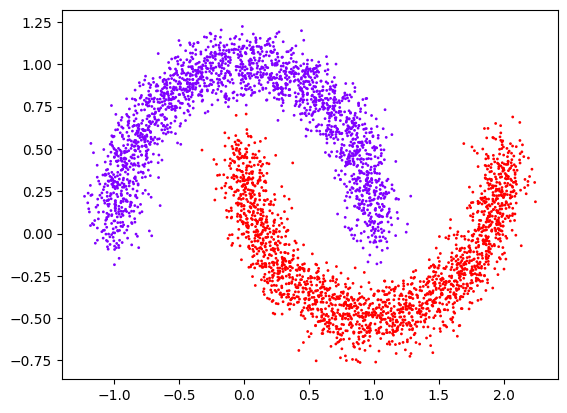
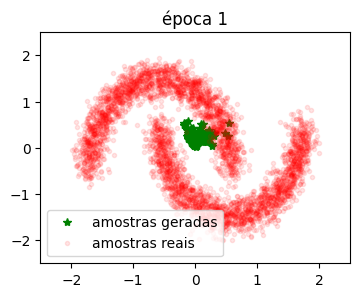
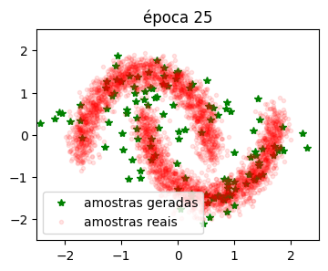
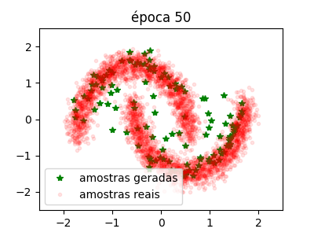
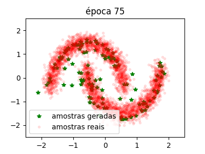
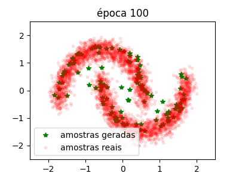
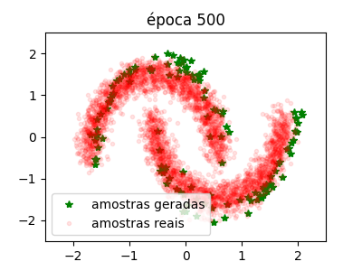
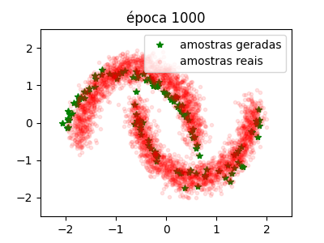
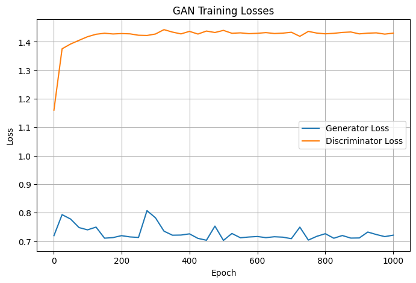

# Tarefa 01 - GAN para aproximar distribuição two moons

## Introdução

O objetivo da tarefa é treinar uma generative adversarial network (GAN) de modo que a distribuição de pontos gerados se aproxime da distribuição `two moons`, como no exemplo abaixo:



## Tratamento dos dados

O conjunto de dados reais foi obtido por meio da biblioteca sklearn:
```python
from sklearn.datasets import make_moons
full_distribution = make_moons(n_samples=4096, noise=0.1, random_state=42)
```

Esse conjunto é composto por dois vetores: o primeiro com as tuplas (x, y) que representam os pontos de dados e o segundo que representa a identificação de qual das duas "luas" da distribuição esse ponto pertence. Esse segundo vetor não será utilizado na atividade. 

Os dados foram normalizados e carregados para um DataLoader da seguinte forma:
```python
distribution = full_distribution[0]
# Normalização x-media/std
train_data = torch.from_numpy(distribution).float() # Transforma lista de tuplas em um tensor pytorch
mean = torch.mean(train_data, dim=0)                # Calcula média 
std = torch.std(train_data, dim=0)                  # Calcula desvio padrão
train_data = (train_data - mean) / std              # Normalização

train_loader = DataLoader(                       # Cria o objeto DataLoader para organizar os dados de treinamento.
    train_data,                                  # Conjunto de dados a ser usado (nosso tensor com pares (x, y)).
    batch_size = batch_size,                     # Número de amostras por lote = 128.
    shuffle = True                               # Embaralha
    )         
```

## Definição dos modelos

Para treinar uma GAN, são necessárias duas redes neurais: Um gerador, para gerar as amostras artificiais, e um discriminador, que busca identificar quais amostras são geradas e quais são artificiais.

### Gerador

O gerador possui 4 camadas totais, sendo uma de entrada para dois valores, duas escondidas com 16 e 32 neurônios, respectivamente, e uma de saída para dois valores. Os dois valores de saída representam a nova amostra artificial gerada pelo modelo. 

```python
Gerador = nn.Sequential(                         # Define o gerador como uma rede neural sequencial (camadas empilhadas).
    nn.Linear(2, 16),                            # Primeira camada linear: entrada com 2 dimensões (vetor de ruído); saída com 16 neurônios.
    nn.ReLU(),                                   # Função de ativação ReLU.
    nn.Linear(16, 32),                           # Segunda camada linear: expande de 16 para 32 neurônios.
    nn.ReLU(),                                   # Função de ativação ReLU.
    nn.Linear(32, 2)                             # Camada de saída: gera 2 valores (x, y) que simulam amostras reais.
).to(device)                                     # Move a rede para o dispositivo escolhido (CPU ou GPU).
```

O número total de parâmetros é de 658.

### Discriminador

O discriminador possui uma sequência de camadas completamente conectadas seguidas de funções ReLU e de Dropout. Sua entrada inicial é de dois valores, uma vez que a saída criada pelo gerador é de dois valores. Sua saída é um valor único que, após inserido na função sigmoide, resulta em uma probabilidade entre 0 e 1 da entrada inicial ser um valor da distribuição real. 

```python
Discriminador = nn.Sequential(                        # Define o discriminador como uma rede sequencial (camadas empilhadas).
    nn.Linear(2, 256),                                # Camada totalmente conectada: entrada com 2 features (x,y); saída com 256 neurônios.
    nn.ReLU(),                                        # Função de ativação ReLU.
    nn.Dropout(0.3),                                  # Dropout: desativa aleatoriamente 30% dos neurônios durante o treinamento.
    nn.Linear(256, 128),                              # Camada linear: reduz de 256 para 128 neurônios.
    nn.ReLU(),                                        # Ativação ReLU.
    nn.Dropout(0.3),                                  # Dropout novamente (30%).
    nn.Linear(128, 64),                               # Camada linear: reduz de 128 para 64 neurônios.
    nn.ReLU(),                                        # Ativação ReLU.
    nn.Dropout(0.3),                                  # Dropout novamente (30%).
    nn.Linear(64, 1),                                 # Camada final: reduz de 64 para 1 saída (probabilidade real/fake).
    nn.Sigmoid()                                      # Função sigmóide: comprime a saída para [0,1], interpretada como probabilidade.
).to(device)                                          # Move a rede para o dispositivo escolhido (CPU ou GPU).
```

O número total de parâmetros é de 41,985

## Treinamento

### Configurações

Definimos a entropia cruzada binária como função de perda, uma vez que o processo será baseado na classificação entre real e artificial feita pelo discriminador.
```python
loss_fn = nn.BCELoss()                            # Define a função de perda Binary Cross-Entropy (BCE)
lr = 0.0005
```

Definimos uma função para treinar o discriminador em amostras reais, de modo que todos os labels sejam iguais a 1 (verdadeira).
```python
def train_D_on_real(real_samples):                  # Função para treinar o discriminador em dados reais.
    real_samples = real_samples.to(device)          # Move o lote de amostras reais para o dispositivo (CPU ou GPU).
    optimD.zero_grad()                              # Zera os gradientes acumulados do otimizador do discriminador.
    out_D = D(real_samples)                         # Passa as amostras reais pelo discriminador: obtém probabilidades (saída).
    loss_D = loss_fn(out_D, real_labels)            # Calcula a perda comparando saída do discriminador com rótulos = 1 (reais).
    loss_D.backward()                               # Propaga os gradientes da perda para atualizar os pesos.
    optimD.step()                                   # Realiza a atualização dos pesos do discriminador (descida do gradiente).
    return loss_D                                   # Retorna o valor da perda para monitoramento.
```

Para treinar o discriminador em amostras falsas, essas amostras devem ser geradas pelo gerador. Agora, todos os labels são igual a 0 (falsa).
```python
def train_D_on_fake():                                # Função para treinar o discriminador em dados falsos (gerados pelo gerador G).
    noise = torch.randn((batch_size, 2))              # Gera um lote de vetores de ruído aleatório ~ N(0,1), shape [batch_size, 2].
    noise = noise.to(device)                          # Move o ruído para o dispositivo (CPU ou GPU).
    fake_samples = G(noise)                           # Passa o ruído pelo gerador: obtém amostras falsas (x, y).
    optimD.zero_grad()                                # Zera os gradientes acumulados do otimizador do discriminador.
    out_D = D(fake_samples)                           # Passa as amostras falsas pelo discriminador: obtém probabilidades.
    loss_D = loss_fn(out_D, fake_labels)              # Calcula a perda comparando saída do discriminador com rótulos = 0 (falsos).
    loss_D.backward()                                 # Propaga os gradientes da perda para os parâmetros do discriminador.
    optimD.step()                                     # Atualiza os pesos do discriminador com base na perda calculada.
    return loss_D                                     # Retorna a perda para monitoramento.
```

Por fim, para treinar o gerador, é necessário gerar as amostras e classificá-las com o discriminador. A diferença para o treinamento anterior está no cálculo da perda com os labels iguais a 1 (verdadeira) e a propagação sendo feita para o gerador, no lugar do discriminador. 

```python
def train_G():                              # Função para treinar o gerador (G).
    noise = torch.randn((batch_size, 2))    # Gera um lote de vetores de ruído aleatório ~ N(0,1), shape [batch_size, 2].
    noise = noise.to(device)                # Move o ruído para o dispositivo (CPU ou GPU).
    optimG.zero_grad()                      # Zera os gradientes acumulados do otimizador do gerador.
    fake_samples = G(noise)                 # Passa o ruído pelo gerador: obtém amostras falsas (x, y).
    out_G = D(fake_samples)                 # Passa as amostras falsas no discriminador: obtém probabilidades.
    loss_G = loss_fn(out_G, real_labels)    # Calcula a perda considerando rótulos = 1, POIS O GERADOR QUER QUE O DISCRIMINADOR CLASSIFIQUE AS AMOSTRAS FALSAS COMO REAIS.
    loss_G.backward()                       # Propaga os gradientes da perda para os parâmetros do gerador.
    optimG.step()                           # Atualiza os pesos do gerador (descida do gradiente).
    return loss_G, fake_samples             # Retorna a perda e as amostras falsas geradas para análise/visualização.
```

### Execução

O treino foi executado em 1000 épocas com batches de 128 amostras.
A cada batch, os 3 treinos são executados em sequência, primeiro o discriminador em amostras reais, em seguida em amostras falsas e, por fim, o gerador é treinado.

```python
for epoch in range(1000):                        # Loop principal de treinamento do GAN (até 1000 épocas no máximo).
    for n, real_samples in enumerate(train_loader):   # Itera sobre os lotes do conjunto de treino.
        loss_D = train_D_on_real(real_samples)        # Treina o discriminador em amostras reais.
        loss_D = train_D_on_fake()                    # Treina o discriminador em amostras falsas (geradas).
        loss_G, fake_samples = train_G()              # Treina o gerador e obtém as amostras falsas da iteração.
```















É possível perceber que, no início, foram geradas amostras completamente aleatórias concentradas nos intervalos entre 0 e 1. Com poucas épocas, essa concentração diminuiu e as gerações foram se aproximando da distribuição original. 

A partir da época 100, o gerador aparenta ter convergido para uma distribuição muito próxima da real. 

É possível perceber, também, que as perdas durante o treinamento não variam muito devido à natureza de aprendizado simultâneo do gerador e do discriminador.

