# Tarefa:

Utilize a base de dados de dígitos MNIST.

1. Modifique a arquitetura do gerador base (reduzindo sua capacidade) mantendo o discriminador base.

por exemplo
- removendo camadas
- reduzindo o número de kernels por camada

2. Modifique a arquitetura do discriminador base (reduzindo sua capacidade) mantendo o gerador base.

por exemplo:
- removendo camadas
- reduzindo o número de kernels por camada

3. Varie as taxas de aprendizado do gerador e do discriminador de forma independente.
0.1 -> 0.001 -> 0.00001

4. Teste um otimizador adicional (ex.: SGD ou Adam).

Mudar os dois para Adam

5. Realize a interpolação entre dois vetores latentes.

## GAN Base

```python
Gerador(
  (net): Sequential(
    (0): Linear(in_features=100, out_features=6272, bias=True)
    (1): Unflatten(dim=1, unflattened_size=(128, 7, 7))
    (2): BatchNorm2d(128, eps=1e-05, momentum=0.1, affine=True, track_running_stats=True)
    (3): ConvTranspose2d(128, 64, kernel_size=(5, 5), stride=(2, 2), padding=(2, 2), output_padding=(1, 1))
    (4): ReLU(inplace=True)
    (5): BatchNorm2d(64, eps=1e-05, momentum=0.1, affine=True, track_running_stats=True)
    (6): ConvTranspose2d(64, 1, kernel_size=(5, 5), stride=(2, 2), padding=(2, 2), output_padding=(1, 1))
    (7): Tanh()
  )
)
Discriminador(
  (net): Sequential(
    (0): Conv2d(1, 64, kernel_size=(5, 5), stride=(2, 2), padding=(2, 2))
    (1): LeakyReLU(negative_slope=0.2)
    (2): Dropout(p=0.4, inplace=False)
    (3): Conv2d(64, 128, kernel_size=(5, 5), stride=(2, 2), padding=(2, 2))
    (4): LeakyReLU(negative_slope=0.2)
    (5): Dropout(p=0.4, inplace=False)
    (6): Flatten(start_dim=1, end_dim=-1)
    (7): Linear(in_features=6272, out_features=1, bias=True)
    (8): Sigmoid()
  )
)
```

- Learning Rate do Gerador: 0.001
- Learning Rate do Discriminador: 0.001
- Otimizador: RMSProp

Imagens aleatórias


Interpolação do espaço latente

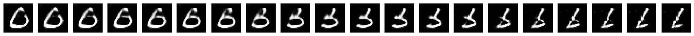

Evolução da perda dos modelos

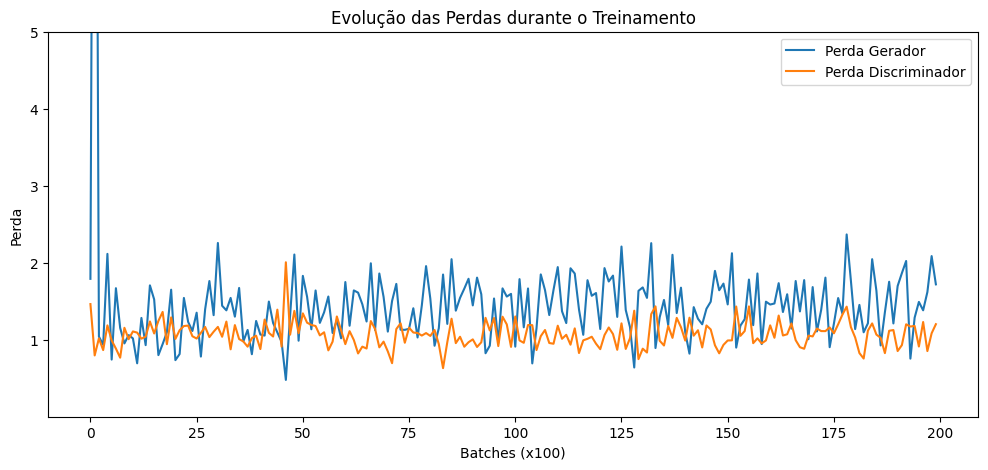

## Com gerador simplificado

```python
Gerador(
  (net): Sequential(
    (0): Linear(in_features=100, out_features=6272, bias=True)
    (1): Unflatten(dim=1, unflattened_size=(32, 14, 14))
    (2): ConvTranspose2d(32, 1, kernel_size=(5, 5), stride=(2, 2), padding=(2, 2), output_padding=(1, 1))
    (3): ReLU(inplace=True)
    (4): Tanh()
  )
)
Discriminador(
  (net): Sequential(
    (0): Conv2d(1, 64, kernel_size=(5, 5), stride=(2, 2), padding=(2, 2))
    (1): LeakyReLU(negative_slope=0.2)
    (2): Dropout(p=0.4, inplace=False)
    (3): Conv2d(64, 128, kernel_size=(5, 5), stride=(2, 2), padding=(2, 2))
    (4): LeakyReLU(negative_slope=0.2)
    (5): Dropout(p=0.4, inplace=False)
    (6): Flatten(start_dim=1, end_dim=-1)
    (7): Linear(in_features=6272, out_features=1, bias=True)
    (8): Sigmoid()
  )
)
```

Imagens aleatórias

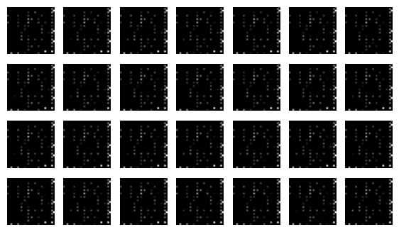

Interpolação do espaço latente

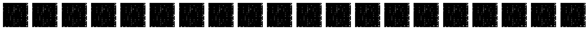

Evolução da perda dos modelos

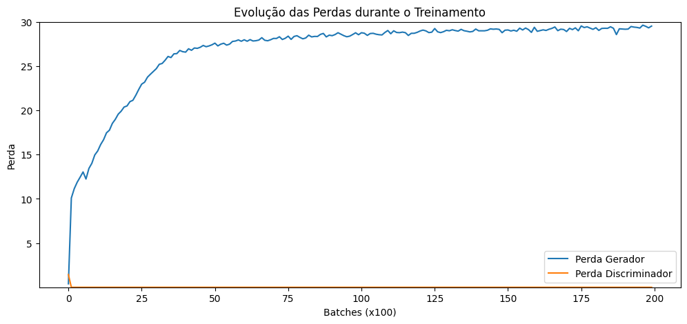

## Com discriminador simplificado

```python
Gerador(
  (net): Sequential(
    (0): Linear(in_features=100, out_features=6272, bias=True)
    (1): Unflatten(dim=1, unflattened_size=(128, 7, 7))
    (2): BatchNorm2d(128, eps=1e-05, momentum=0.1, affine=True, track_running_stats=True)
    (3): ConvTranspose2d(128, 64, kernel_size=(5, 5), stride=(2, 2), padding=(2, 2), output_padding=(1, 1))
    (4): ReLU(inplace=True)
    (5): BatchNorm2d(64, eps=1e-05, momentum=0.1, affine=True, track_running_stats=True)
    (6): ConvTranspose2d(64, 1, kernel_size=(5, 5), stride=(2, 2), padding=(2, 2), output_padding=(1, 1))
    (7): Tanh()
  )
)
Discriminador(
  (net): Sequential(
    (0): Conv2d(1, 16, kernel_size=(5, 5), stride=(2, 2), padding=(2, 2))
    (1): LeakyReLU(negative_slope=0.2)
    (2): Dropout(p=0.4, inplace=False)
    (3): Flatten(start_dim=1, end_dim=-1)
    (4): Linear(in_features=3136, out_features=1, bias=True)
    (5): Sigmoid()
  )
)
```

Imagens aleatórias

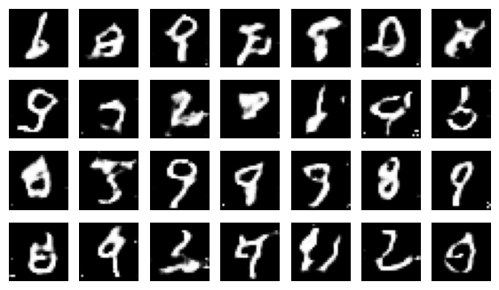

Interpolação do espaço latente

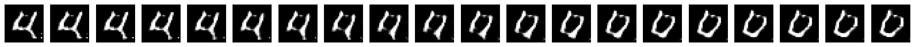

Evolução da perda dos modelos

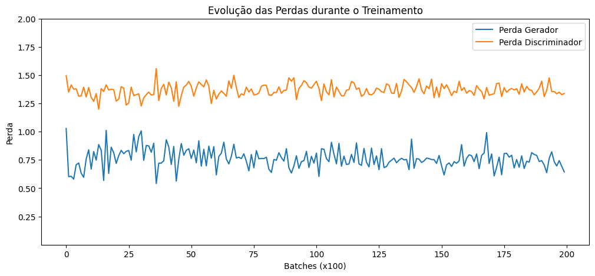

## Com learning rate exagerado (0.5)
### Gerador

Imagens aleatórias

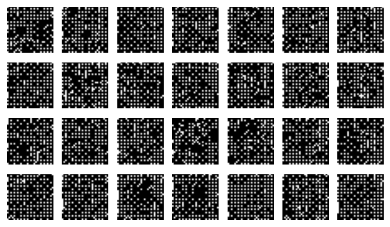

Interpolação do espaço latente

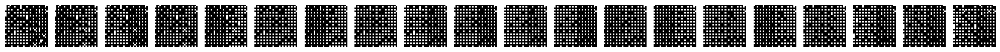

Evolução da perda dos modelos

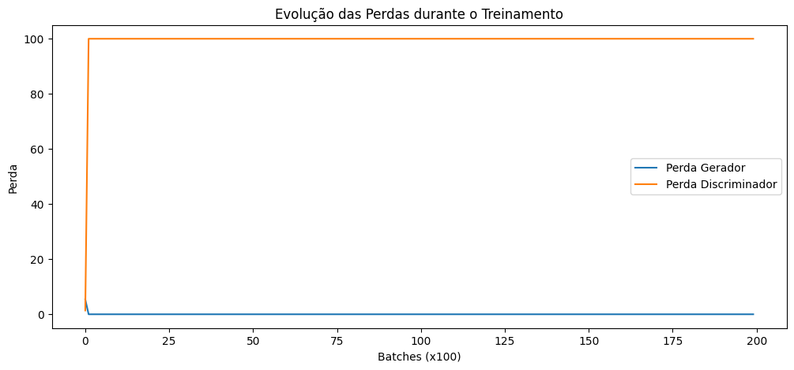

### Discriminador

Imagens aleatórias

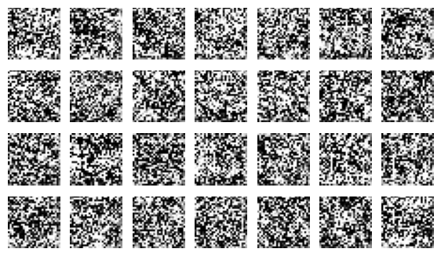

Interpolação do espaço latente

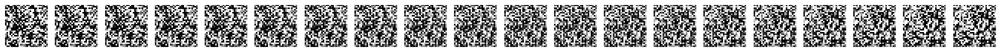

Evolução da perda dos modelos

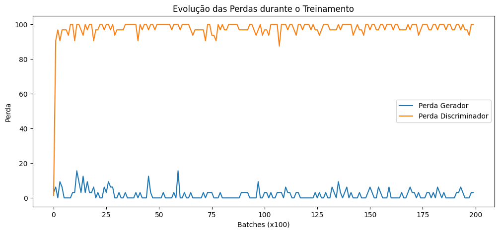

## Com learning rate muito pequeno (0.00001)
### Gerador

Imagens aleatórias

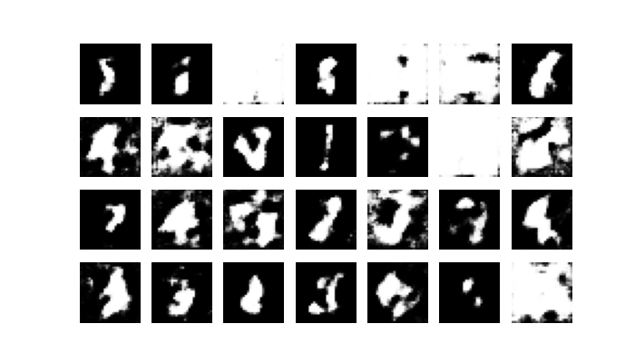

Interpolação do espaço latente


Evolução da perda dos modelos


### Discriminador

Imagens aleatórias

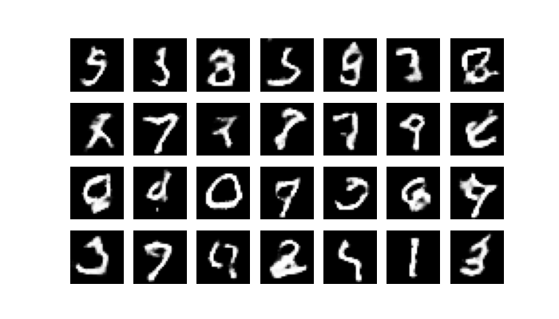

Interpolação do espaço latente

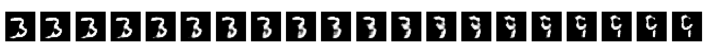

Evolução da perda dos modelos

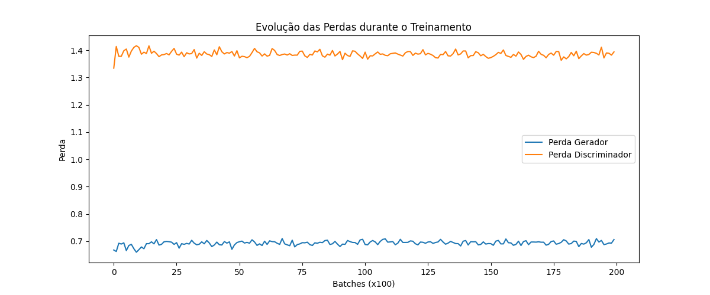


## Utilizando otimizador Adam

Imagens aleatórias

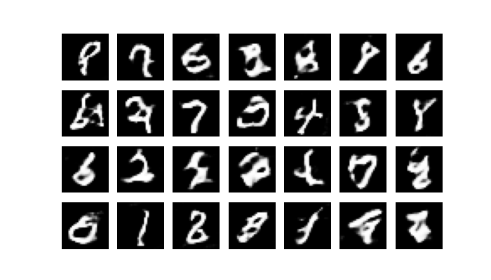

Interpolação do espaço latente

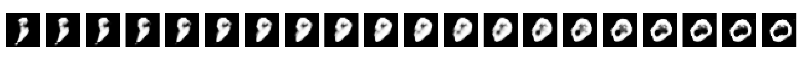

Evolução da perda dos modelos

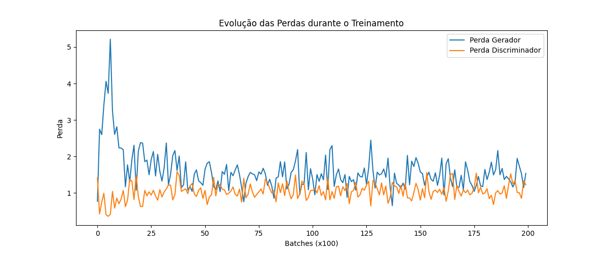
