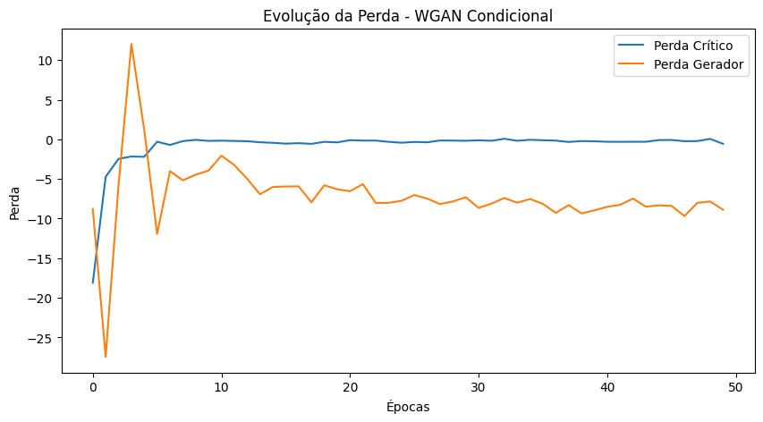
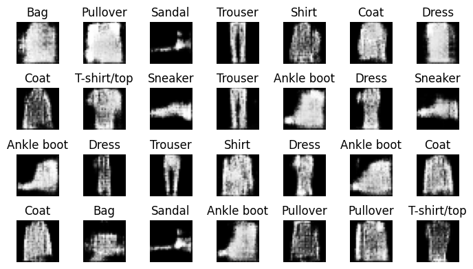
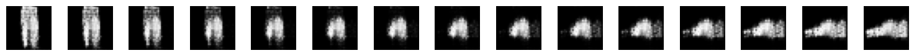
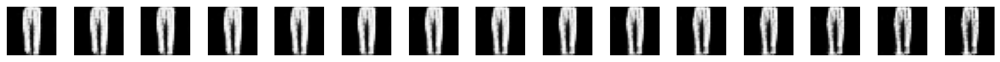
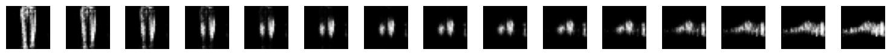
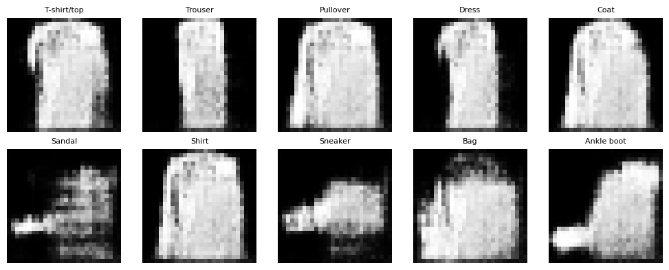

# Tarefa:

1. Implementar uma WCGAN condicional e treinar o modelo com o conjunto de dados Fashion MNIST.

    a. Mostre os gráficos das funções de perda do gerador e do discriminador.

    b. Mostre imagens geradas com o modelo.

2. Interpolar entre vetores de ruído e mostrar as imagens intermediárias considerando:

    a. z fixo e interpolacão linear entre classes [c1, c2].

    b. classe c fixa e interpolaćão linear entre [z1, z2].

    c. interpolaćão linear entre [z1, z2] e [c1, c2].

3. Fixe o vetor de ruído e altere apenas o rótulo para observar como a imagem muda.

**Entregáveis**:
1. Notebook `.ipynb`.
2. Relatório `.pdf`:

    - Reporte e comente os resultados no relatório.

    - Incluir imagens geradas.

## Definição dos modelos

### Gerador
```python
class Gerador(nn.Module):
    def __init__(self, z_dim=100, num_classes=10):
        super().__init__()

        # Definimos a rede sequencial do gerador
        self.rede_neural = nn.Sequential(
            # Camada totalmente conectada                                                       
            # Entrada: (lote, z_dim + num_classes)  (vetor de ruído z concatenado com rótulo com codificação one-hot)
            nn.Linear(z_dim + num_classes, 7 * 7 * 128),
            nn.Unflatten(1, (128, 7, 7)),
            nn.BatchNorm2d(128),
            nn.ConvTranspose2d(128, 64, kernel_size=5, stride=2, padding=2, output_padding=1),
            nn.ReLU(),
            nn.BatchNorm2d(64),
            nn.ConvTranspose2d(64, 1, kernel_size=5, stride=2, padding=2, output_padding=1),
            nn.Tanh()
        )

    def forward(self, z, rotulo_one_hot):
        # Concatena o vetor de ruído com o vetor de rótulo one-hot:
        entrada = torch.cat([z, rotulo_one_hot], dim=1)  # Entrada: (lote, z_dim + num_classes)
        return self.rede_neural(entrada)                 # Saída: (lote, 1, 28, 28)
```

### Crítico

O crítico funciona de maneira muito similar a um discriminador em uma GAN condicional qualquer, porém sem a função de ativação sigmoide ao final. 
Ao receber uma imagem e um vetor one-hot encoded que determina a classe da imagem, é feita a transformação do vetor de rótulos em canais da imagem.

```python
class Critico(nn.Module):
    def __init__(self, num_classes=10, tam_img=28):
        super().__init__()
        self.num_classes = num_classes
        self.tam_img = tam_img

        self.rede_neural = nn.Sequential(
            # entrada: [lote, 1 + num_classes, 28, 28] 
            # (1 canal da imagem + canais do rótulo)
            nn.Conv2d(in_channels=1 + num_classes, out_channels=64, kernel_size=5, stride=2, padding=2),
            nn.LeakyReLU(negative_slope=0.2),
            nn.Dropout(0.4),
            nn.Conv2d(in_channels=64, out_channels=128, kernel_size=5, stride=2, padding=2),
            nn.LeakyReLU(negative_slope=0.2),
            nn.Dropout(0.4),
            nn.Flatten(),

            # Camada totalmente conectada sem função de ativação ao fim
            nn.Linear(7 * 7 * 128, 1),
        )

    def forward(self, imagem, rotulos_one_hot):
        # imagem: (B, 1, H, W) | rotulos_one_hot: (B, C)
        _, _, H, W = imagem.shape
        # (B, C, 1, 1) -> (B, C, H, W)  [expand cria uma view]
        # Cria um tensor do tamanho da imagem, preenchido com os valores do rótulo one-hot, onde cada canal corresponde a um rótulo
        mapa_rotulo = rotulos_one_hot[:, :, None, None].expand(-1, -1, H, W)
        # (B, 1+C, H, W)  [concatenar a imagem com o mapa de rótulo no eixo de canais]
        entrada = torch.cat((imagem, mapa_rotulo), dim=1)
        return self.rede_neural(entrada)
```

## Treinamento

O treinamento é muito similar a uma GAN comum, porém o cálculo da perda é feito por meio da diferença entre as médias. Abaixo está descrito o código de treinamento para uma época.

```python
for batch_idx, (dados_reais, rotulos_reais) in enumerate(dataloader):
    batch_size = dados_reais.size(0)
    dados_reais = dados_reais.to(device)
    rotulos_reais = rotulos_reais.to(device)

    # Converte os rótulos reais para one-hot
    rotulos_reais_one_hot = F.one_hot(rotulos_reais, num_classes=num_classes).float()

    rotulos_reais_one_hot = rotulos_reais_one_hot.to(device)

    # CRÍTICO (DISCRIMINADOR)
    for _ in range(n_critic):
        
        z = torch.randn((batch_size, z_dim), device=device)

        # Gera dados falsos USANDO OS MESMOS RÓTULOS REAIS (matching label approach)
        dados_falsos = gerador(z, rotulos_reais_one_hot)

        # Avalia dados reais (imagem real + rótulo real)
        saida_reais = crítico(dados_reais, rotulos_reais_one_hot)

        # Avalia dados falsos (imagem gerada + rótulo real)
        saida_falsos = crítico(dados_falsos, rotulos_reais_one_hot)

        # Perda do crítico: soma das perdas para dados reais e falsos
        perda_crítico = saida_falsos.mean() - saida_reais.mean()

        opt_crítico.zero_grad()
        perda_crítico.backward()
        opt_crítico.step()

        # Clipping dos pesos do crítico para satisfazer Lipschitz
        for p in crítico.parameters():
            p.data.clamp_(-clip_value, clip_value)

    # GERADOR
    z = torch.randn((batch_size, z_dim), device=device)

    # Gera dados falsos novamente (com os rótulos reais do batch)
    dados_falsos = gerador(z, rotulos_reais_one_hot)

    # Faz o crítico avaliar estes dados falsos
    saida_falsos = crítico(dados_falsos, rotulos_reais_one_hot)

    # Perda do gerador: queremos que o crítico ache que são reais
    perda_gerador = -saida_falsos.mean()

    # Otimiza o gerador
    opt_gerador.zero_grad()
    perda_gerador.backward()
    opt_gerador.step()
```

## Resultados

Utilizando as seguintes configurações de treino:

```python
lr_gerador = 1e-5       
lr_crítico = 1e-5  
optimizador_gerador = torch.optim.RMSprop(modelo_gerador.parameters(), lr=lr_gerador)
optimizador_crítico = torch.optim.RMSprop(modelo_crítico.parameters(), lr=lr_crítico)
epochs=50
n_critic=5,
clip_value=0.01,
```
Obtivemos a seguinte progressão de perda ao longo das 50 épocas



### Exemplos de imagens geradas



### Interpolação entre classes com z fixo



### Interpolação entre vetores latentes com classe fixa 



### Interpolação entre vetores latentes e classes



### Geração de diferentes classes com z fixo

