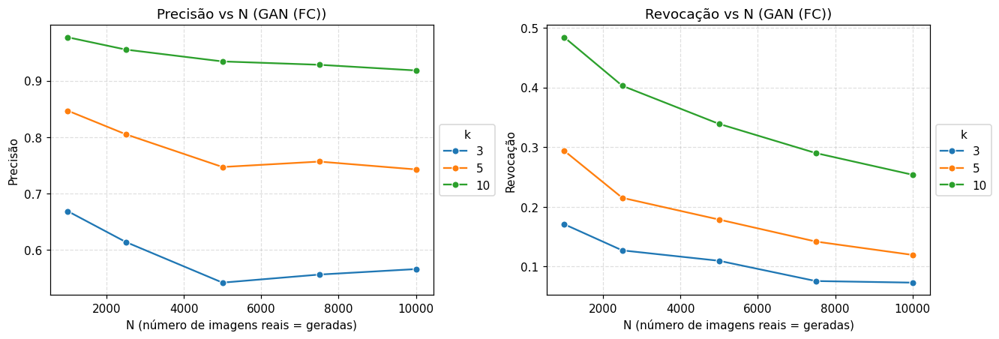
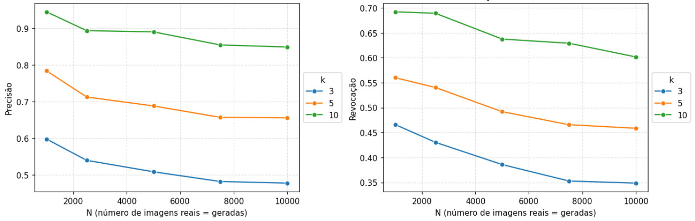
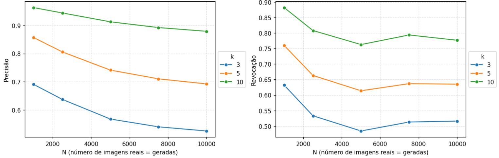

# Tarefa

1. Treinar os seguintes modelos (não condicionais) utilizando o conjunto de **treinamento** MNIST (ou Fashion MNIST):

- GAN (com camadas completamente conectadas, isto é, GAN **NÃO** convolucional)
- DCGAN (convolucional)
- WGAN (convolucional)

Observação: A utilização dos laboratórios anteriores é permitida. Nesse caso, salvar os modelos treinados e carregar tais modelos aqui.

2. Comparar os modelos utilizando as curvas de MPR para diferentes valores do parâmetro `k` (mostre os gráficos com legendas para os modelos). Utilize o conjunto de **teste** MNIST (ou Fashion MNIST) para a aproximação da variedade dos dados reais.

- Qual o comportamento da precisão e revocação ao se aumentar o valor de k?

3. Varie o número de imagens `N=[1000, 2500, 5000, 7500, 10000]` utilizadas (utilize o mesmo valor para o número de imagens reais e o número de imagens geradas) no cálculo da precisão e revocação. Observe o comportamento das curvas de precisão e revocação (para `k=[3, 5, 10]`) para cada modelo.

- Mostrar 3 gráficos, um para cada modelo.

**Entregáveis**:
1. Notebook `.ipynb`.
2. Relatório `.pdf`:

    - Reporte e comente os resultados no relatório.

    - Incluir gráficos gerados.

# Modelos
## GanFC
https://colab.research.google.com/drive/1WDo8sdP0ODHq2odkd3qWYNtMRXKQgH6y#scrollTo=5-DQ-Q-h47K2
```python
gen_model = nn.Sequential(
    nn.Linear(z_size, gen_hidden_size),
    nn.LeakyReLU(),
    nn.Linear(gen_hidden_size, np.prod(image_size)),
    nn.Tanh()
)
```
## WGan
https://colab.research.google.com/drive/1RKtlyr4-RQ3W7IN90xUopGL_8UmBC1pF#scrollTo=BxoQbkRS-OT_
```python
class Gerador(nn.Module):

    def __init__(self, z_dim=100):
        super().__init__()
        self.net = nn.Sequential(
            nn.Linear(z_dim, 7*7*128),
            nn.Unflatten(dim=1, unflattened_size=(128, 7, 7)),
            nn.BatchNorm2d(128),
            nn.ConvTranspose2d(128, 64, kernel_size=5, stride=2, padding=2, output_padding=1),
            nn.ReLU(True),
            nn.BatchNorm2d(64),
            nn.ConvTranspose2d(64, 1, kernel_size=5, stride=2, padding=2, output_padding=1),
            nn.Tanh()
        )

    def forward(self, x):
        return self.net(x)
```


## DCGan
https://colab.research.google.com/drive/15tVRsKXBJ5LvAzt_5CfLzbXaYypod3Zm#scrollTo=BxoQbkRS-OT_
```python
class Gerador(nn.Module):
    def __init__(self, z_dim=100):
        super().__init__()
        self.net = nn.Sequential(
            nn.Linear(z_dim, 7*7*128),
            nn.Unflatten(dim=1, unflattened_size=(128, 7, 7)),
            nn.BatchNorm2d(128),
            nn.ConvTranspose2d(128, 64, kernel_size=5, stride=2, padding=2, output_padding=1),
            nn.ReLU(True),
            nn.BatchNorm2d(64),
            nn.ConvTranspose2d(64, 1, kernel_size=5, stride=2, padding=2, output_padding=1),
            nn.Tanh()
        )

    def forward(self, z):
        return self.net(z)
```

# Resultados

Após analisar os resultados, é possível perceber dois comportamentos principais:
- Ao aumentar o valor do parâmetro `k`, a precisão e a revocação tendem a aumentar, uma vez que a área dos manifolds aumenta.
- Tanto a precisão quanto a revocação tendem a diminuir ao aumentar-se o número de pontos gerados.

## GanFC

## WGan

## DCGan
