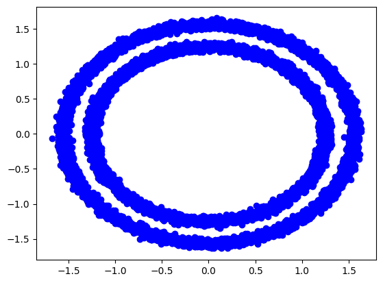
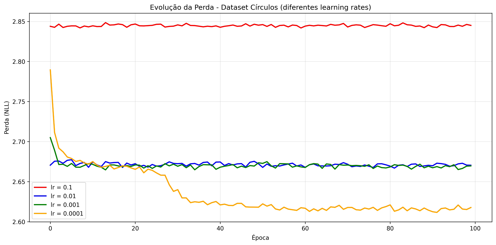
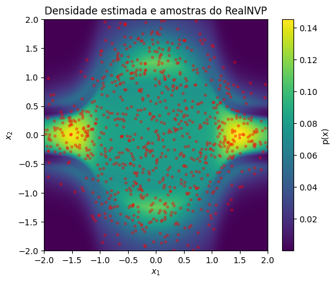
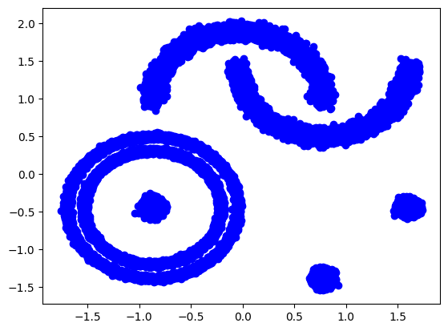
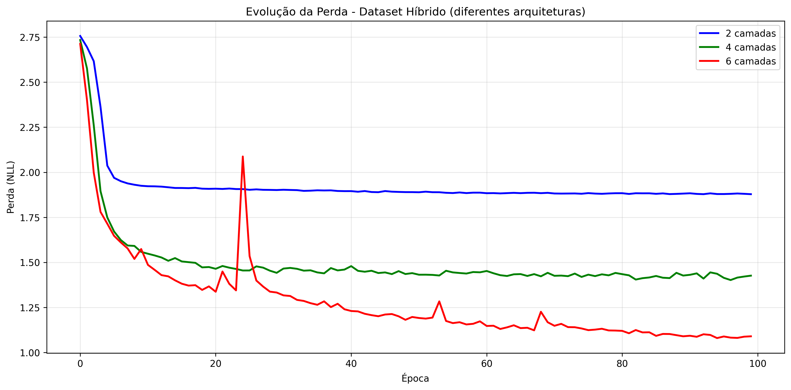
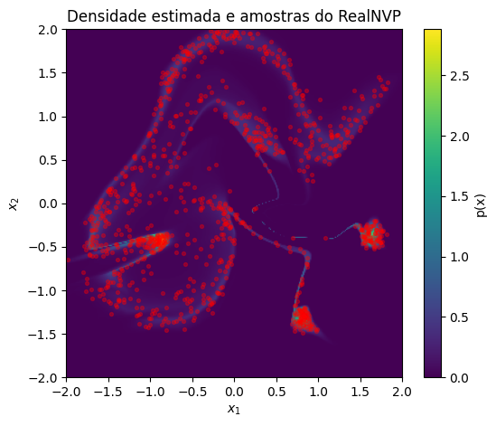

# Tarefa

1. Replique o experimeto com o conjunto de dados `make_circles` do scikit-learn:
    ``` python
    data, _ = datasets.make_circles(n_samples=10000, noise=0.02, random_state=42)
    ```

- Treine o mesmo modelo por um mesmo número de épocas (ex.: 100) com 4  taxas de aprendizado (`lr`) diferentes: $0.1, 0.01, 0.001, 0.0001$.
    - Para cada modelo, gere 1000 amostras e produza `plotar_heatmap` (densidade + amostras).
    - Capture a perda por época.
    - Construa em um único gráfico: época x perda para os 4 valores.
    - Analise as curvas.
    - Comente sobre a geração dos dados sintéticos desses modelos.

2. Utilizando o seguinte conjunto de dados:

    ``` python
    X1, _  = datasets.make_circles(n_samples=10000, noise=0.02, random_state=42)
    X2, _ = datasets.make_moons(10000, noise=0.05)
    X3, _ = datasets.make_blobs(10000, cluster_std=0.05, center_box=(-3,3), centers=np.array([[0,0], [2, -1], [3, 0]]))
    X2[:, 0] += 1
    X2[:, 1] += 1.5
    data = np.vstack((X1, X2, X3))
    ```

- Fixe `lr = 1e-4` e treine 3 arquiteturas RelNVP:
    - 2 camadas de acoplamento (baseline)
    - 4 camadas de acoplamento
    - 6 camadas de acoplamento
 - Para cada modelo, gere 1000 amostras e produza `plotar_heatmap` (densidade + amostras).
- Capture a perda por época.
- Construa em um único gráfico: época x perda para os 3 valores.

- Analise as curvas.
- Comente sobre a geração dos dados sintéticos desses modelos.

**Entregáveis**:
1. Notebook `.ipynb`.
2. Relatório `.pdf`:

    - Reporte e comente os resultados no relatório.

    - Incluir gráficos gerados.

# 1. Dataset círculos

```python
num_camadas_acoplamento=2
learning_rate = 1e-1
weight_decay = 1e-2
optimizer = torch.optim.Adam(model.parameters(), lr=learning_rate, weight_decay=weight_decay)
11
n_epochs=100
```



Para o dataset de dois círculos, foi possível perceber que learning rates mais baixos apresentaram perdas mais baixas ao longo das épocas. Todos os modelos alcançaram um plateau antes das 40 épocas mesmo sem gerar representações realistas da distrbuição original.



No entanto, mesmo com a evidente melhoria, as perdas continuaram muito altas e os resultados não foram satisfatórios. A distribuição de 1000 amostras geradas para o melhor modelo treinado está representada abaixo, claramente bem diferente da apresentada inicialmente.



# 2. Dataset híbrido
```python
num_camadas_acoplamento=2
learning_rate = 1e-4
weight_decay = 1e-2
optimizer = torch.optim.Adam(model.parameters(), lr=learning_rate, weight_decay=weight_decay)

n_epochs=100
```



Para o dataset híbrido, foi possível perceber que modelos de maior capacidade (mais camadas de acoplamento) alcançaram melhores resultados ao longo das épocas, chegando a losses menores. Os modelos mais simples alcançaram um plateau em sua perda rapidamente, enquanto o com 6 camadas aparenta ter continuado "aprendendo" até a centésima época.



Apesar de não conseguir representar perfeitamente a distribuição, os resultados obtidos pelo melhor modelo (com 6 camadas) foram muito melhores que os alcançados no exercício anterior.


