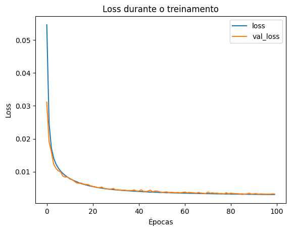

# Tarefa

1. Replique o experimento com o conjunto de dados `MNIST` do Pytorch:
    ``` python
    train_full  = datasets.MNIST(root="data", train=True, download=True) 
    test_ds     = datasets.MNIST(root="data", train=False, download=True)
    ```

  e os seguintes Autoencoders: convolucional, esparso e por remoção de ruído. Para cada modelo teste 3 valores distintos para a dimensionalidade do espaço latente.

- **Capture a perda (MSE) por época.** 
- **Mostre as reconstruções**

**Entregáveis**:
1. Notebook `.ipynb`.
2. Relatório `.pdf`:
    - Reporte e comente os resultados no relatório.
    - Incluir gráficos gerados.


# Autoencoder determinístico convolucional

Para o autoencoder convolucional, todas as reconstruções apresentaram resultados aceitáveis, porém é claramente perceptível que espaços latentes maiores geraram maior quantidade de detalhes. Além disso, a loss ao longo das épocas se mostrou bem mais estável com valores de z maiores.

## z = 2


## z = 32


## z = 64




# Autoencoder determinístico esparso
Com o autoencoder esparso, o menor tamanho de espaço latente foi o que apresentou as melhores reconstruções (talvez pela simplicidade do dataset). Apesar de um treinamento com bem mais oscilação no erro, o patamar geral de erro do z=64 foi bem abaixo dos outros experimentos.
## z = 64


## z = 300


## z = 600


# Autoencoder determinístico de remoção de ruído

O autoencoder de remoção de ruído apresentou um comportamento similar ao convolucional, porém, no caso do espaço latente de tamanho 2, todas as gerações se tornaram idênticas. Já para os valores mais altos de z, o treinamento de mostrou mais estável e as gerações melhores, mas não tão bem definidas quanto na versão convolucional.

## z = 2


## z = 32


## z = 64


