# Tarefa

1. Replique o experimeto com o conjunto de dados `MNIST` do Pytorch:
    ``` python
    train_full  = datasets.MNIST(root="data", train=True, download=True) 
    test_ds     = datasets.MNIST(root="data", train=False, download=True)
    ```

  e os seguintes Autoencoders: convolucional, esparso e por remoção de ruído. Para cada modelo teste 3 valores distintos para a dimensionalidade do espaço latente.

- **Capture a perda (MSE) por época.** 
- **Mostre as reconstruções**

**Entregáveis**:
1. Notebook `.ipynb`.
2. Relatório `.pdf`:
    - Reporte e comente os resultados no relatório.
    - Incluir gráficos gerados.


# Autoencoder determinístico convolucional

## z = 2
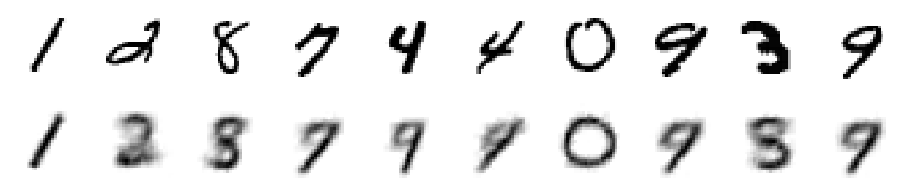

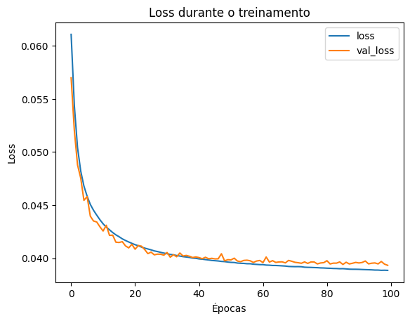
## z = 32

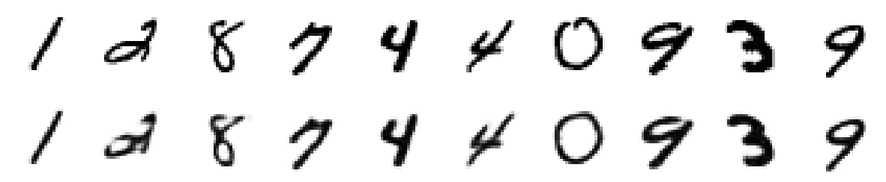


## z = 64
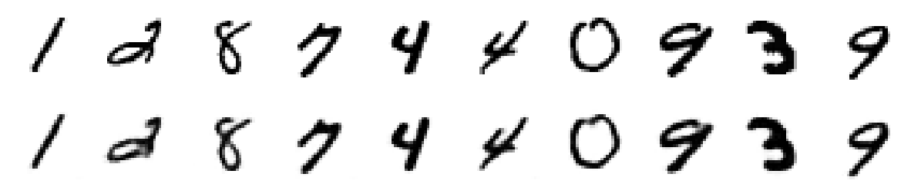


# Autoencoder determinístico esparso

## z = 64
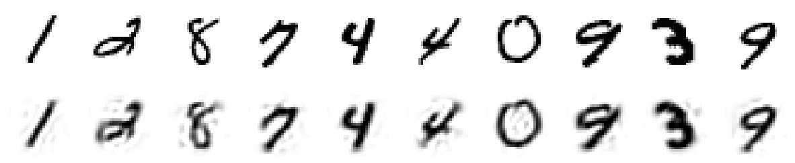

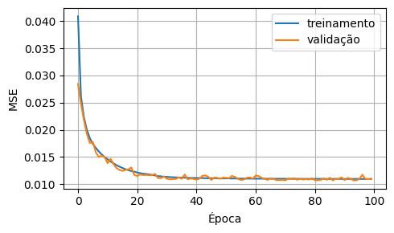
## z = 300
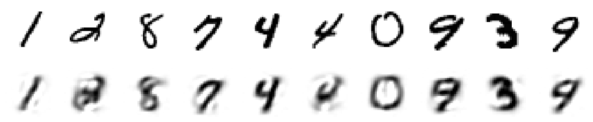

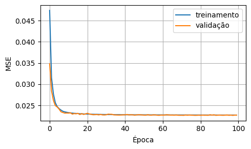
## z = 600
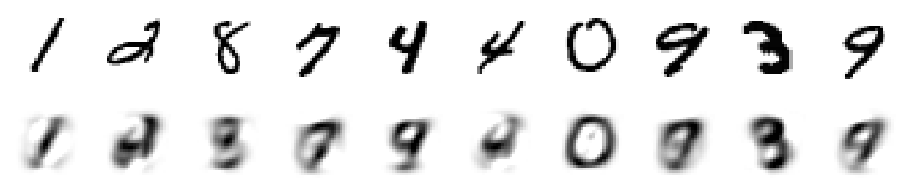

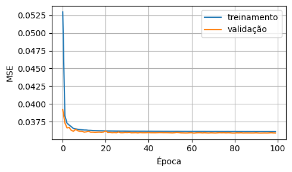

# Autoencoder determinístico de remoção de ruído

## z = 2
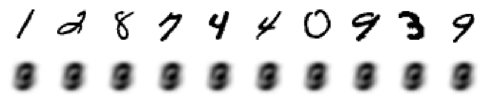

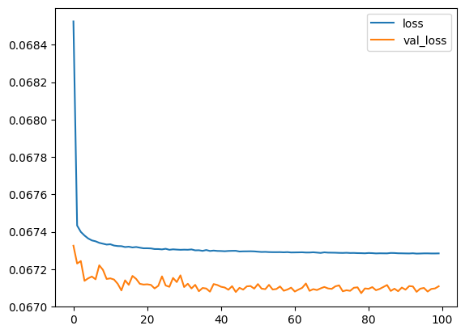
## z = 32
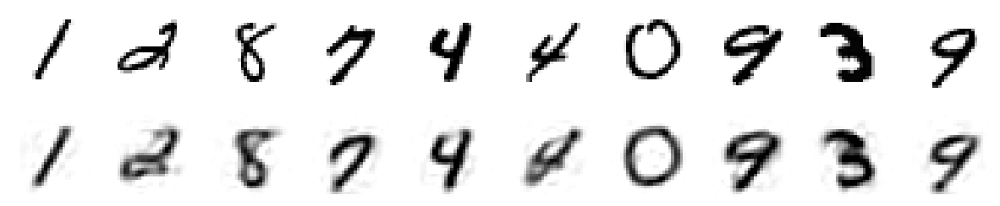

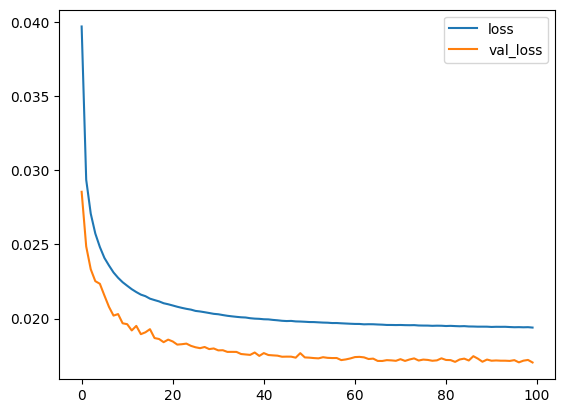
## z = 64
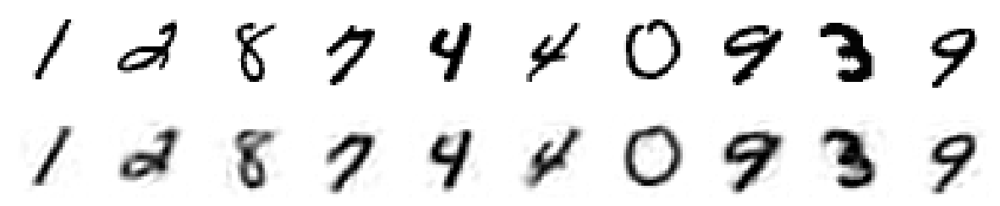

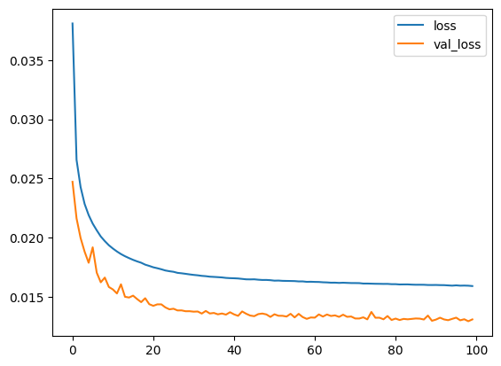