# Tarefa

- Conjunto de dados a ser utilizado MNIST (ao invés do Fashion MNIST):

``` python
train_data  = datasets.MNIST(root="data", train=True, download=True)
test_data   = datasets.MNIST(root="data", train=False, download=True)
```

1. Implemente uma versão convolucional do VAE.
2. Treine a versão convolucional do VAE com os valores diferentes para o parâmetro $\beta$ (ex.: $\beta=\in\{0, 0.1, 100\}$).
    - Mostre o termo de reconstrução (MSE), o termo de regularização (KL) e a função de perda por época (usando `curvas_de_treinamento`).
    - Mostre as reconstruções (usando `mostrar_reconstrucoes`)
    - Mostre o espaço latente (usando visualizar_espaco_latente e `visualizar_grade_latente`)
    - Gere amostras sintéticas (usando `gerar_amostras_aleatorias`)

**Entregáveis**:
1. Notebook `.ipynb`.
2. Relatório `.pdf`:
    - Reporte e comente os resultados no relatório.
    - Incluir gráficos gerados.

# Explicação

Para implementar um VAE convolucional, foi construído um encoder da seguinte forma:
```python
self.net = nn.Sequential( # 1, 28, 28
            nn.Conv2d(1, 16, kernel_size=3, padding=1), # 16,28,28
            nn.ReLU(),
            nn.MaxPool2d(2), # 16, 14, 14
            nn.Conv2d(16, 32, kernel_size=3, padding=1), # 32,14,14
            nn.ReLU(),
            nn.MaxPool2d(2), # 32, 7, 7
            nn.Conv2d(32, 64, kernel_size=3, padding=1), # 64,7,7
            nn.ReLU(),
            nn.Flatten() # achata para vetor
        )
self.camada_media = nn.Linear(64*7*7, dimensao_latente)
self.camada_log_variancia = nn.Linear(64*7*7, dimensao_latente)
self.camada_amostragem = CamadaAmostragemLatente()
```
De modo que parte convolucional recebe uma imagem 1x28x28 e retorna um vetor de tamanho 64*7*7

Já o decoder foi construído da seguinte forma:
```python
self.fc = nn.Linear(dimensao_latente, 7 * 7 * 64)
self.net = nn.Sequential(
    nn.ConvTranspose2d(64, 32, kernel_size=4, stride=2, padding=1),  # 64,7,7 -> 32,14,14
    nn.ReLU(),
    nn.ConvTranspose2d(32, 16, kernel_size=4, stride=2, padding=1),  # 32,14,14 -> 16,28,28
    nn.ReLU(),
    nn.ConvTranspose2d(16, 1, kernel_size=3, stride=1, padding=1),   # 16,28,28 -> 1,28,28
    nn.Sigmoid()
)
```
De modo que sua rede convolucional receba um vetor de tamanho 7*7*64 e reconstrua uma imagem de dimensões 1x28x28. Ao fim da rede, é utilizada a função sigmoide de ativação para normalizar os valores entre 0 e 1 (como são os valores das imagens do dataset).

Para os experimentos, foi mantido o valor latente = 2 para permitir visualizações melhores. O parâmetro beta determina a influência da divergência KL na função de perda: valores maiores de beta aproximam o espaço latente de uma distribuição normal padrão, enquanto valores menores priorizam a qualidade da reconstrução.

# Experimentos

## Beta = 0
Com beta = 0, o termo de regularização KL é completamente ignorado, gerando reconstruções muito similares ao autoencoder determinístico de mesmo tamanho de espaço latente. O MSE (erro de reconstrução) converge rapidamente e o termo KL cresce livremente, pois não há penalização para afastamento da distribuição normal padrão.

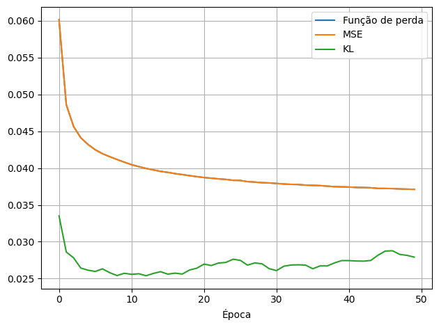

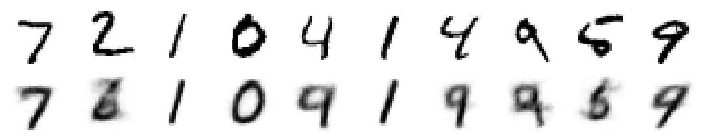

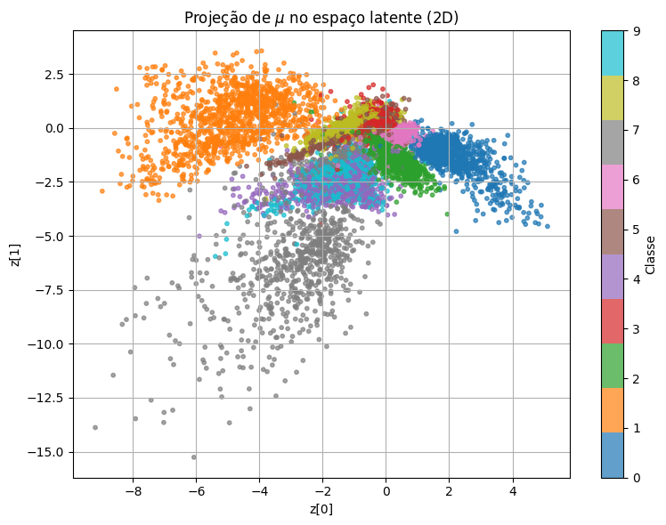

Reconstruções aleatórias
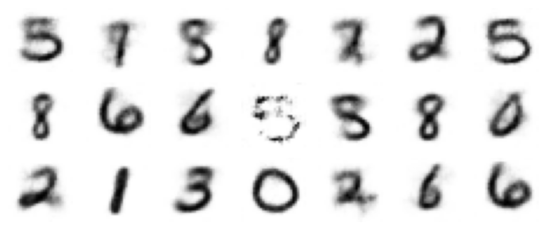

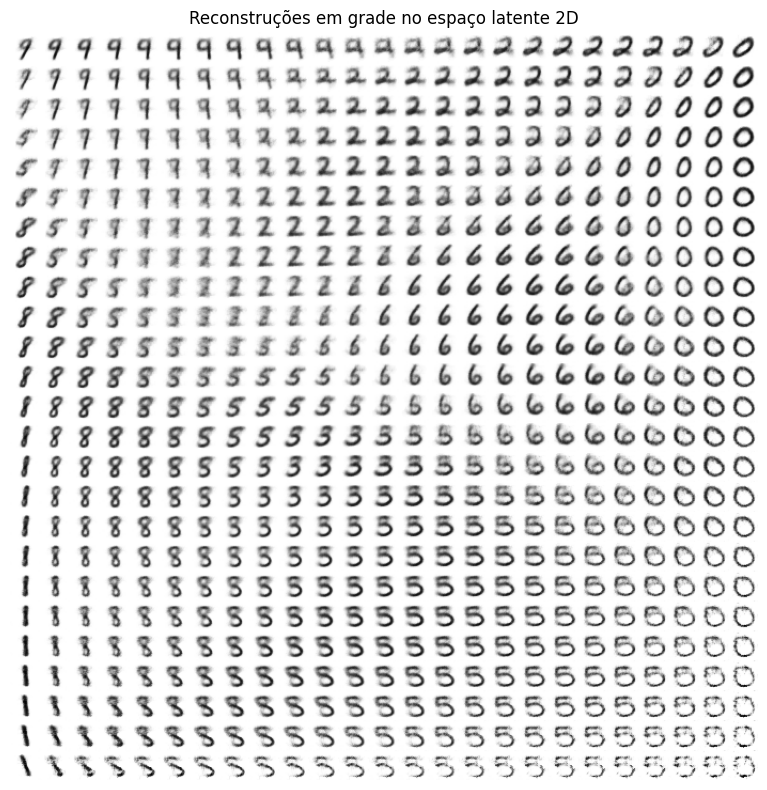

## Beta = 0.1

Já para o beta = 0.1, o termo de regularização é levado em conta e, por consequência, se mantêm estável ao longo do treinamento. O MSE ainda atinge valores relativamente baixos, garantindo reconstruções aceitáveis e o termo KL é moderadamente penalizado, forçando alguma estrutura no espaço latente.

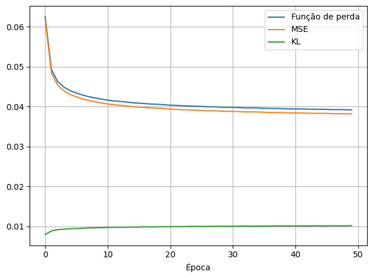

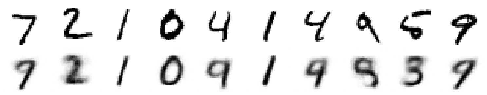

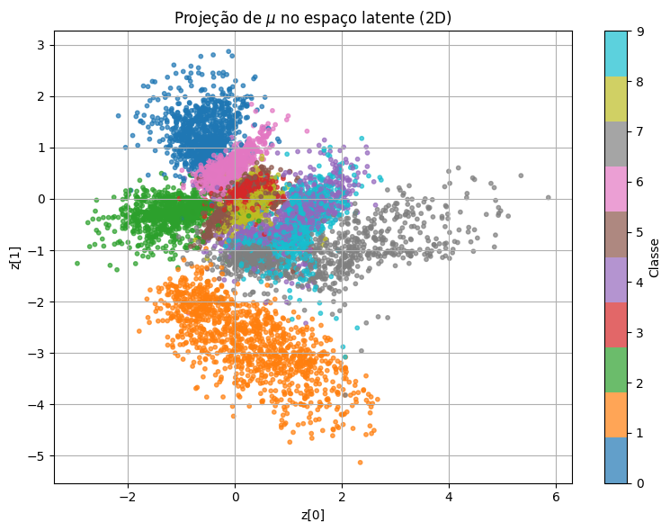

Reconstruções aleatórias
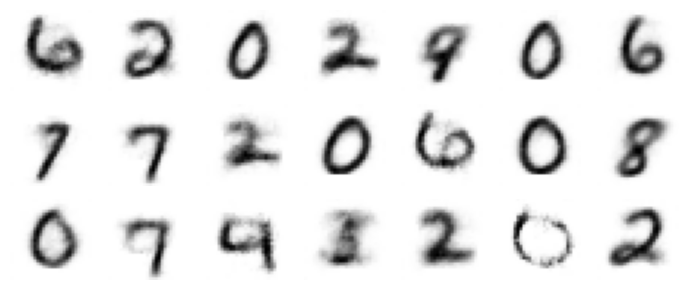

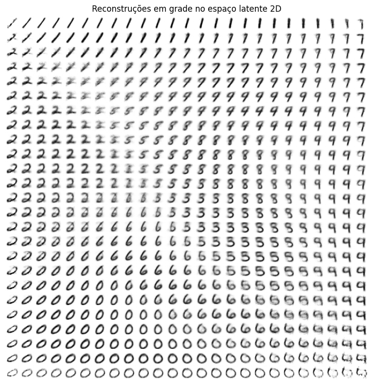


## Beta = 100

Para este valor extremo de beta, é possível perceber claramente o colapso sofrido pelo espaço latente, de modo que todas as classes sejam mapeadas para o mesmo ponto e que todas as imagens geradas sejam idênticas. O MSE se mantém alto e estático durante todo o treinamento e o termo KL se mantém nulo e estático também.

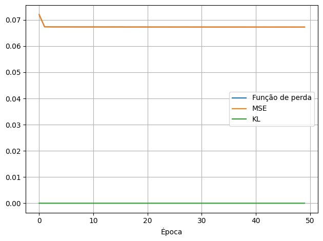

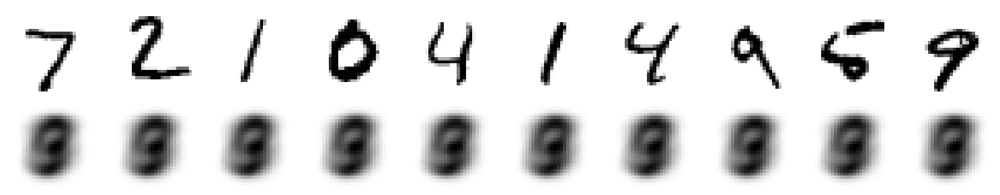

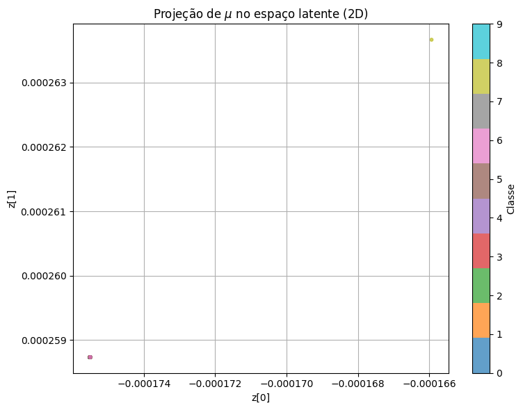

Reconstruções aleatórias
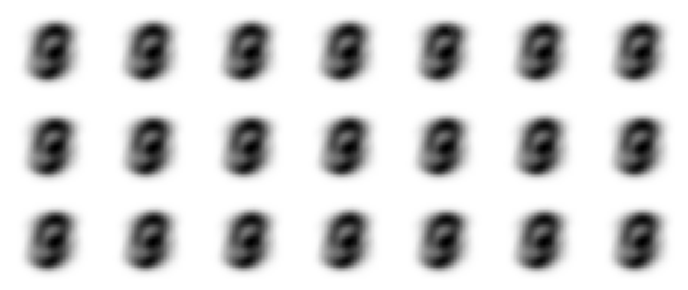

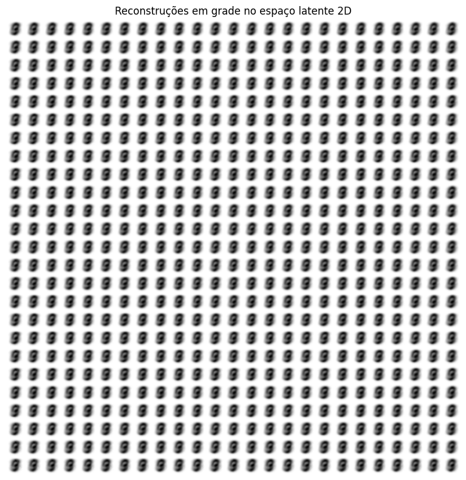