# Tarefa

- Realize experimentos com 3  valores diferentes de NUM_STEPS e EMBEDDING_SIZE.

- Mostre as figuras com os processos direto e reverso de difusão.

O objetivo do modelo é aproximar a distribuição "swiss roll", representada pelos pontos laranjas no gráfico abaixo.

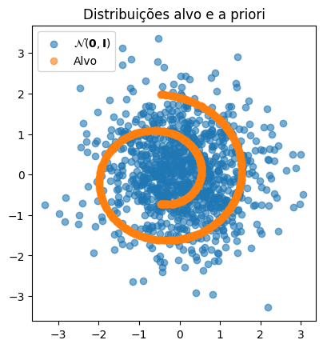

Será explorada a seguinte matriz de hiperparâmetros:

NUM_STEPS | EMBEDDING_SIZE |
|----------:|---------------:|
| 50  | 16 |
| 50  | 32 |
| 50  | 2 |
| 500 | 2 |
| 500 | 16 |
| 500 | 32 |
| 1000 | 2 |
| 1000 | 16 |
| 1000 | 32 |
# Resultados

Com os experimentos realizados, foi possível perceber a importância dos embeddings temporais para o aprendizado dos modelos de difusão. Os modelos com embeddings de tamanho 2 se mantiveram acima de 0.5 de perda durante todo o treinamento e, ao fim, não foram capazes de gerar uma distribuição próxima da esperada. Já os modelos com embedding size 16 e 32 apresentaram loss similar e boas reconstruções para 50, 500 e 1000 passos.

## T = 50
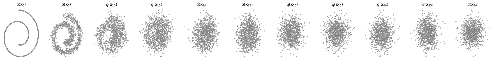
### Embedding size = 2

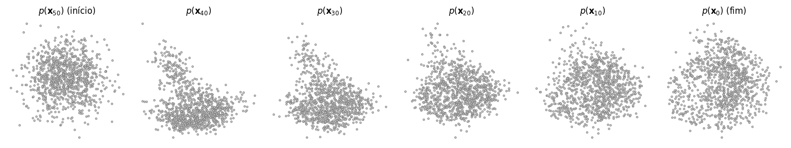
### Embedding size = 16
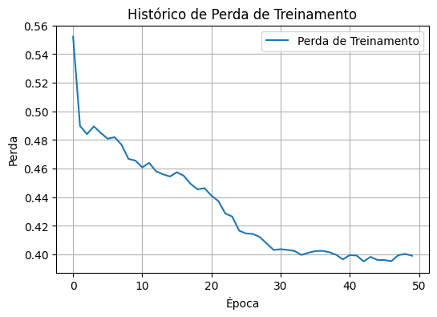
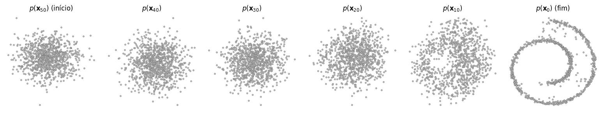
### Embedding size = 32
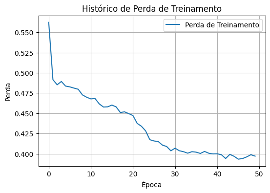
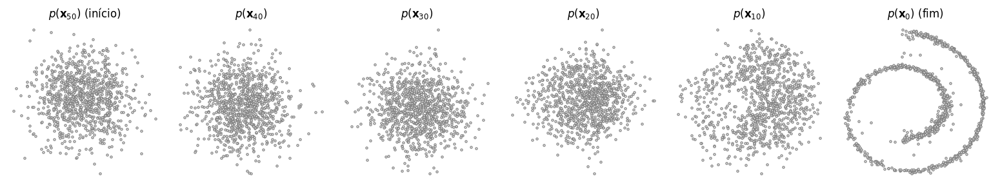

## T = 500
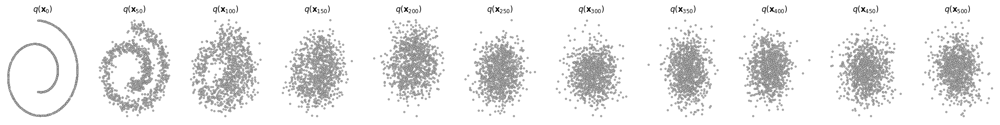
### Embedding size = 2

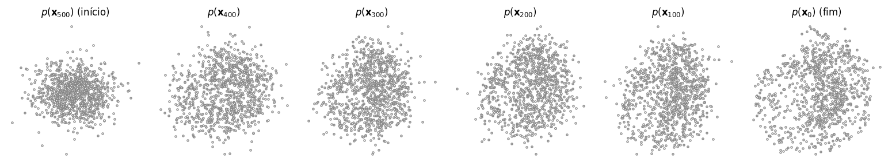
### Embedding size = 16
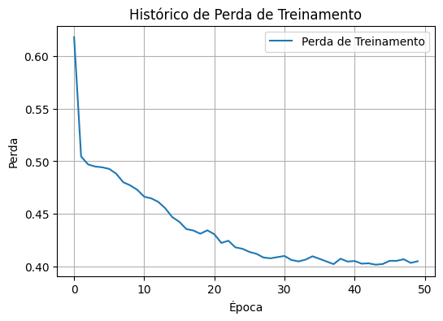
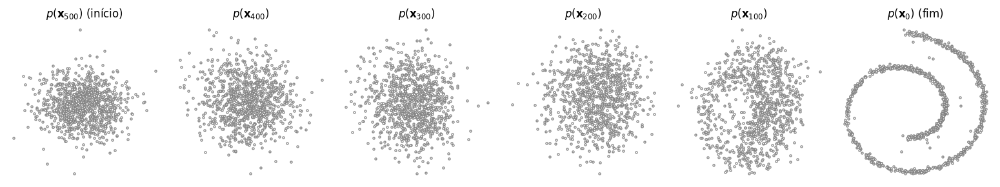
### Embedding size = 32
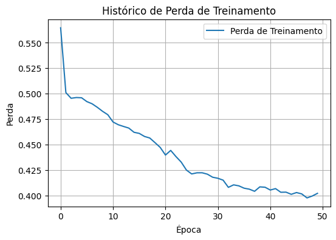
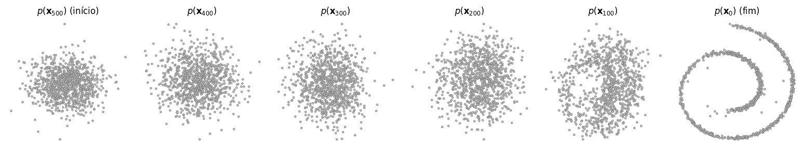

## T = 1000
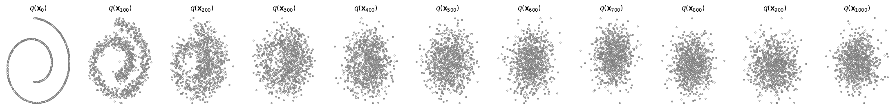
### Embedding size = 2
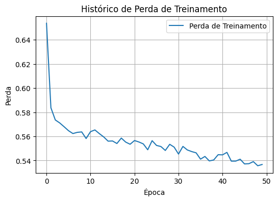
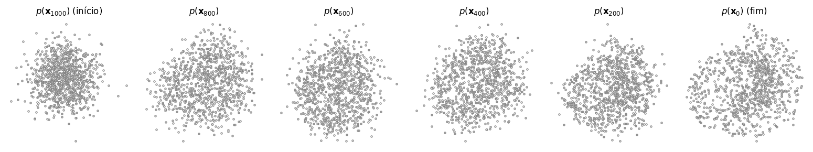
### Embedding size = 16
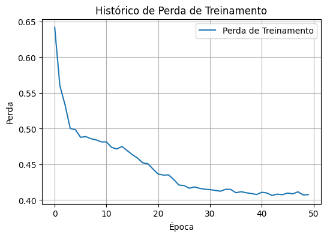
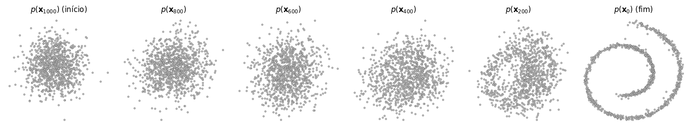
### Embedding size = 32
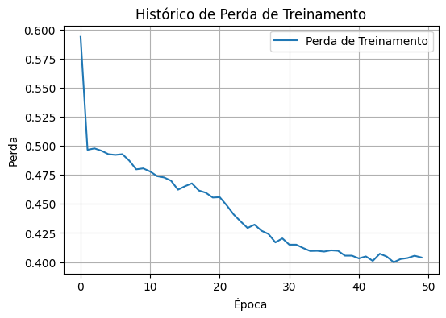
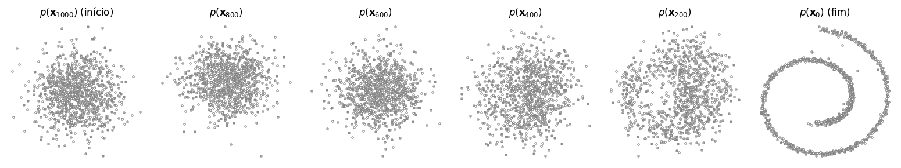
