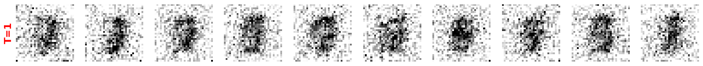
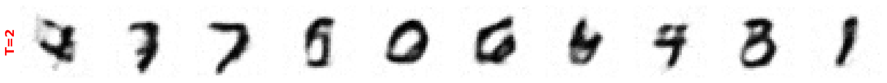
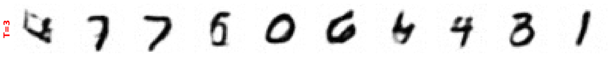
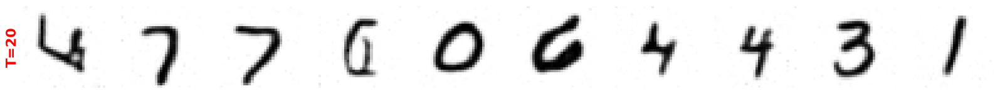
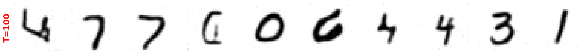
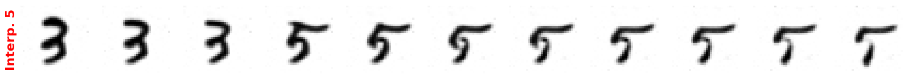
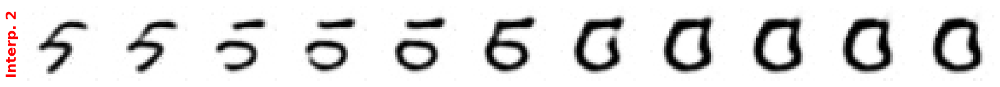
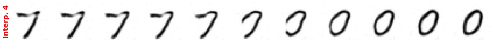
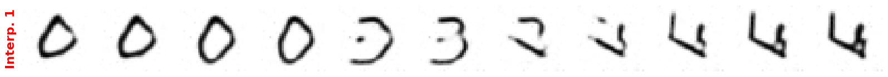

# Tarefa:

1. Treine um modelo de difusão com um outro conjunto de dados MNIST (`from torchvision.datasets import MNIST`). Faça as seguintes alterações nos hiperparâmetros:

``` python
IMAGE_SIZE = 32                 # tamanho das imagens (32x32)
NUM_CHANNELS = 1                # número de canais da imagem
```

Faça as alterações necessárias no código para carregar a base de dados MNIST. Diferentemente do que foi feito com o conjunto Oxford flowers, não utilize repetições dos dados.

2. Observe e reporte como o número de passos T afeta a geração de novas imagens.
3. Interpole entre duas imagens no espaço latente e reporte os resultados. Repita o procedimento para 4 pares de imagens.

# Carregamento dos dados

O dataset MNIST foi carregado da seguinte forma:
```python
# Carrega conjunto de treinamento (baixado automaticamente se não existir)
train_data = MNIST(
    root="dados",
    train=True,
    transform=transformacao_imagem,
    download=True,
)

# Transforms (resize + ToTensor)
transform = transforms.Compose([
    transforms.Resize((IMAGE_SIZE, IMAGE_SIZE)),                                                    # redimensiona p/ 64x64
    transforms.ToTensor(),                                                                          # converte p/ tensor com valores no intervalo [0,1]
])

# DataLoader
train_dl = DataLoader(
    train_data,
    batch_size=BATCH_SIZE,
    shuffle=True,
    drop_last=True,
    num_workers=4 
)
```

# Variação de T
Ao observar a geração de novas amostras com diferente números de passos T, foi possível perceber que, para este simples conjunto de dados, duas etapas de difusão são suficientes para gerar amostras com um realismo aceitável. O aumento no valor T, no entanto, melhora a definição das  reconstruções.








# Interpolação no espaço latente
No geral as interpolações ficaram bem coerentes. A última interpolação apresentada, no entanto, parece ter passado pelo número 3 no caminho intermediário entre 0 e 4.







