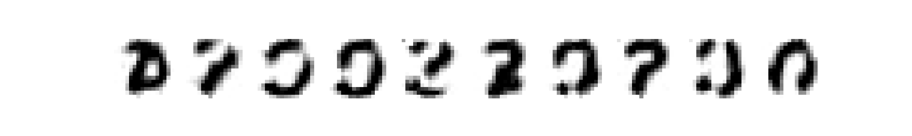
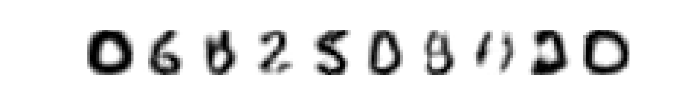
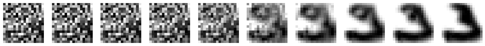
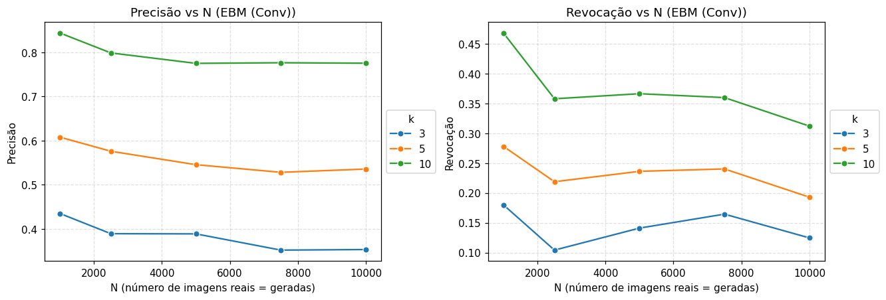

# Tarefa
- Implemente um modelo baseado em energia utilizando uma rede convolucional.
- Realize o treinamento com o conjunto de dados USPS.
- Reporte as imagens sintéticas geradas.
- Reporte o influência do número de passos do processo de Langevin na geração das amostras.
- Reporte o desempenho do modelo treinado utilizando precisão e revocação de variedades (Lab 6).


Foi implementada uma rede convolucional com a seguinte arquitetura

```python
ConvNet = nn.Sequential(
    nn.Conv2d(CHANNELS, 32, kernel_size=3, stride=1, padding=1),  # (B,1,16,16) -> (B,32,16,16)
    nn.SiLU(),
    nn.MaxPool2d(2),                                              # (B,32,16,16) -> (B,32,8,8)
    nn.Conv2d(32, 64, kernel_size=3, stride=1, padding=1),        # (B,32,8,8) -> (B,64,8,8)
    nn.SiLU(),
    nn.MaxPool2d(2),                                              # (B,64,8,8) -> (B,64,4,4)
)

EBMNet = nn.Sequential(
    ConvNet,
    nn.Flatten(),                              # (B,64,4,4) -> (B, 64*4*4) vetoriza a imagem
    nn.Linear(64 * 4 * 4, 512),                # camada densa inicial: pixels -> 512 features
    nn.SiLU(),                                 # ativação SiLU (swish) = suave, útil p/ EBMs
    nn.Linear(512, 512),                       # camadas densas
    nn.SiLU(),
    nn.Linear(512, 1)                          # saída escalar: valor de energia E(x)
)
```

O treinamento, em sua primeira época, já demonstrou resultados melhores que o modelo não convolucional


E em sua melhor época, as gerações foram:



A influência do número de passos de langevin pode ser observada na figura abaixo, em que a imagem é praticamente apenas ruído até 30 passos. Após isso, a reconstrução começa a ficar visível e, a partir dos 300 passos, temos algo aceitável.


0, 1, 3, 5, 10, 30, 50, 100, 300, 999


O gráfico de precisão mostra que o modelo conseguiu aprender e gerar amostras dentro do espaço treinado, porém ainda há muito espaço para melhoria, uma vez que, para k=3, menos de 50% das amostras estiveram dentro do intervalo esperado.
Já a revocação revela que a diversidade do modelo ficou bem abaixo do ideal, com menos de 50% do espaço coberto mesmo com k=10. 

