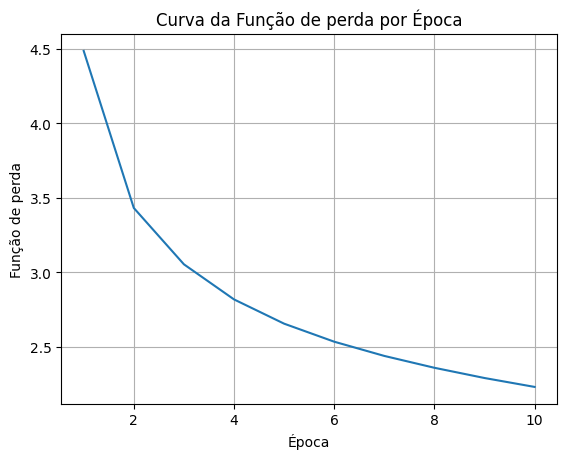

# Tarefa
- Treinar um modelo MiniGPT com a base de dados [Epicurious - Recipes with Rating and Nutrition](https://www.kaggle.com/datasets/hugodarwood/epirecipes) utilizada no laboratório 13:

  - `[TAREFA]_lab_13_ARMs_RNN.ipynb`.

- Experimentar com os hiperparâmetros do bloco transformer (e redimensionar se necessário para essa base de dados)
- Gere dados sintéticos variando a temperatura (ex. 0.1, 0.5, 1.0, 1.5)
- Comparar como os resultados obtidos laboratório 13 com as redes neurais recorrentes (utilizando *perplexity*).

**Entregáveis**:
1. Notebook `.ipynb`
2. Relatório `.pdf`

# Hiperparâmetros disponíveis
```python
VOCAB_SIZE       = 10_000
MAX_LEN          = 80
EMBEDDING_DIM    = 256
KEY_DIM          = 256
N_HEADS          = 2
FEED_FORWARD_DIM = 256
SEED             = 42
BATCH_SIZE       = 32
EPOCHS           = 10
LEARNING_RATE    = 3e-4
```

# Experimentos
Para todos os testes, foi utilizado o prompt "recipe for roasted vegetables" com `max_tokens` = 15, de modo a se aproximar dos experimentos realizados no exercício anterior.

Os hiperparâmetros experimentados serão:
- N_HEADS (Número de cabeças de atenção) = 1 -> 2 -> 8
- FEED_FORWARD_DIM = 64 -> 256 -> 1024

## Modelo padrão
- Temperatura = 0.1: preheat oven to 450°f . toss together all ingredients in
- Temperatura = 0.5: preheat oven to 325°f . toss onions with juices and
- Temperatura = 1.0: toss cantaloupe with the ginger and corn syrup in a
- Temperatura = 1.5: preheat the oven to 325°f . under turkey generously onto

Os resultados falaram sobre ingredientes que não tem muita relação com o tema de salada, como peru. Talvez a palavra torrado influencie isso.


## N_HEADS = 1
- Temperatura = 0.1: preheat oven to 350°f . butter and flour two 9'
- Temperatura = 0.5: preheat oven to 400°f . toss peaches with 2 tablespoons'
- Temperatura = 1.0: preheat oven to 450°f . and line baking sheet with'
- Temperatura = 1.5: working pineapple maintain ajvar stock : their juices jelly pot

Com apenas uma cabeça, o modelo perde a capacidade de atender múltiplos aspectos simultaneamente. Apesar da primeira frase fazer sentido(nas primeiras 3 gerações), nenhuma das sequências tem relação com a temática da receita requisitada.

## N_HEADS = 8
- Temperatura = 0.1: preheat oven to 450°f . line a baking sheet with
- Temperatura = 0.5: cook bacon in heavy large skillet over medium heat until
- Temperatura = 1.0: preheat oven to 350°f . cook feuille , skin sides'
- Temperatura = 1.5: in a seeds and cayenne blender increase curls saucy scrub'

N_HEADS=8 gerou instruções mais específicas, como "line a baking sheet", porém ainda sugeriu ingredientes que não tem a ver com a temática, como bacon.

## FEED_FORWARD_DIM = 64
- Temperatura = 0.1: preheat oven to 350°f . butter and flour a 9'
- Temperatura = 0.5: preheat oven to 350°f . butter a 9 - inch
- Temperatura = 1.0:  preheat oven to 350°f . butter 13x9x2 - inch glass
- Temperatura = 1.5:long short ends on large platter well pour olive roasted'

Apesar de um início coerente, o restante das frases não faz muito sentido, com constrções como "butter 13x9x2 - inch glass" e "long short ends on large platter".

## FEED_FORWARD_DIM = 1024
- Temperatura = 0.1: preheat oven to 350°f . line a baking sheet with'
- Temperatura = 0.5: preheat oven to 350°f . line 2 large baking sheets
- Temperatura = 1.0: combine all ingredients in heavy large pot ; boil until'
- Temperatura = 1.5: heat oven to 500°f in a breadcrumb 12 - ounce'

Resultados similares ao N_HEADS = 8. No geral bem positivo, com instruções específicas e ingredientes coerentes.


## FEED_FORWARD_DIM = 1024 + N_HEADS = 8
- Temperatura = 0.1:  preheat oven to 350°f . butter and flour a 9'
- Temperatura = 0.5: preheat oven to 350°f . butter and flour a 9'
- Temperatura = 1.0:  place passover rack in center of oven ; preheat to'
- Temperatura = 1.5: preheat the [UNK] pie crust with blueberries and blueberries .'


# Perplexity

| Modelo | Perplexity | Parâmetros Chave | Melhoria vs RNN |
|--------|-----------|------------------|-----------------|
| **RNN Clássica** | 13.10 | - | - (baseline) |
| **GRU** | 10.31 | - | **21.3% melhor**|
| **LSTM** | 10.31 | - | **21.3% melhor**|
| **MiniGPT (Padrão)** | 12.43 | N_HEADS=2, FF=256 | 5.1% melhor |
| **MiniGPT (N_HEADS=1)** | 13.22 | N_HEADS=1, FF=256 | 0.9% pior|
| **MiniGPT (N_HEADS=8)** | 12.38 | N_HEADS=8, FF=256 | 5.5% melhor |
| **MiniGPT (FF=64)** | 13.95 | N_HEADS=2, FF=64 | 6.5% pior|
| **MiniGPT (FF=1024)** | 11.56 | N_HEADS=2, FF=1024 | 11.8% melhor|
| **MiniGPT (FF=1024+N_HEADS=8)** | 11.61 | N_HEADS=8, FF=1024 | 11.4% melhor|

Apesar da arquitetura Transformer ser teoricamente superior, LSTM e GRU ainda superam todos os modelos MiniGPT testados em perplexity.
Algumas possíveis razões são o pequeno tamanho de dataset e o fato do MiniGPT possuir apenas uma camada de transformers. Além disso, a baixa quantidade de épocas pode ser um fator determinante, uma vez que foi possível perceber que a loss ainda estava em queda ao fim do treinamento.



# Comentários
Em todos os experimentos, o attention deu mais importancia ao "roasted" do que aos "vegetables", isso pode ter levado à geração de ingredientes que não fazem sentido, como bacon ou turkey, bem como ao foco do modelo no passo de pré aquecimento do forno.

